# Control Module

This folder contains the SystemVerilog source files and testbenches related to the control logic of the FastConv architecture. The control module orchestrates the data flow and operation sequencing across the convolution datapath.

## `Control`

The main control module imports packages such as `pack_def`, `pack_typedef`, and `pack_param` to define shared widths, type aliases, and configuration parameters used throughout the design.

### Parameters

| Parameter                        | Type    | Description                                                                                                                       |
| -------------------------------- | ------- | --------------------------------------------------------------------------------------------------------------------------------- |
| Various configuration parameters | Various | Parameters defining widths, sizes, and operational modes to customize the controller behavior for different convolution instances |

### Ports

| Port                 | Direction    | Type    | Description                                                                                                                        |
| -------------------- | ------------ | ------- | ---------------------------------------------------------------------------------------------------------------------------------- |
| Clock, reset signals | Input        | `logic` | Standard synchronous inputs for timing and initialization control                                                                  |
| Control signals      | Output       | `logic` | Control flags to enable/disable submodules, start operations, signal completion, and manage data flow across FIFOs and multipliers |
| Status signals       | Input/Output | `logic` | Feedback paths to monitor state machines, data availability, and error conditions                                                  |

The control module typically drives multiple finite state machines (FSMs) to manage the sequencing of operations such as input buffering, transform stages, multiplication scheduling, and output assembly.

### Additional Notes

- The control logic carefully handles synchronization between data arrival, processing stages, and mux selection.
- The design emphasizes modularity to enable reuse of the control subsystem across different FastConv configurations with varying window sizes and channel counts.
- Testbenches located in this folder simulate the control logic with representative stimuli and validate correct operation through assertion checks and waveform inspection.

Use this module as a reference guide to understand the control flow governing the convolution pipeline in the FastConv SystemVerilog project.

## FSM Overview

Two main FSMs partition the controller responsibilities: the input-side machine coordinates memory fetches and handshake timing, while the output-side machine sequences accumulation and writes. The Mermaid sources live in `docs/*.mmd`, and pre-rendered SVGs (`docs/*.svg`) are embedded below using relative paths so the diagrams display without external services.

### Input FSM

Purpose: orchestrate the bias placeholder, weight streaming, and input window loads. The transitions below reflect the combinational `next_st_input` logic up to `control.sv:280`.

States:

- `I` (`IDLE_INPUT`): wait for `p_start`; counters and base addresses remain cleared.
- `W` (`WEIGHT`): stream kernel weights until the current tile finishes.
- `FR` (`FIRST_READ_INPUT`): fill the window buffer directly after loading weights.
- `T` (`TRANSFER`): prepare hand-off to the convolution core; may fall through immediately.
- `R` (`READ_INPUT`): refill the sliding window and manage horizontal reuse.

Sources: `docs/input-fsm.mmd`, `docs/input-fsm.svg`

### Output FSM

Purpose: handshake with the convolution core, optionally read back output tiles, and dispatch writes based on window/channel completion. The diagram is derived from the combinational `next_st_output` logic up to `control.sv:280`.

States:

- `I` (`IDLE_OUTPUT`): await `p_start` before engaging downstream stages.
- `C` (`CONV`): wait for the convolution block to report completion.
- `FW` (`FIRST_WRITE_OUTPUT`): first write phase for a channel; decides whether to loop or advance.
- `E` (`END_CHANNEL`): bridge between write and readback phases when more accumulation is needed.
- `R` (`READ_OUTPUT`): pull existing output data to seed the accumulator.
- `CS` (`CONV_SUM`): wait for the accumulator handshake to finish.
- `W` (`WRITE_OUTPUT`): write updated windows back to memory and assess termination.

Sources: `docs/output-fsm.mmd`, `docs/output-fsm.svg`

