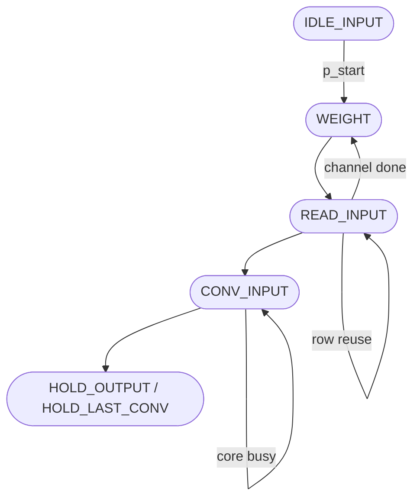
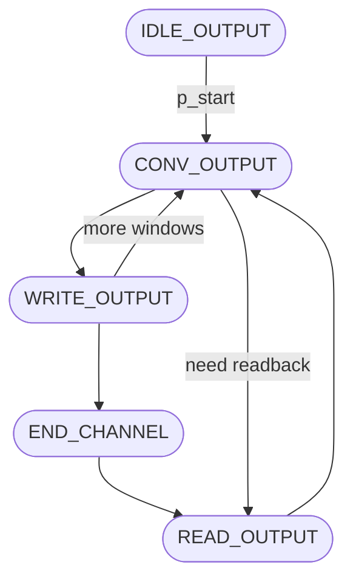

# Control Module

This folder contains the SystemVerilog source files and testbenches related to the control logic of the FastConv architecture. The control module orchestrates the data flow and operation sequencing across the convolution datapath.

## `Control`

The main control module imports packages such as `pack_def`, `pack_typedef`, and `pack_param` to define shared widths, type aliases, and configuration parameters used throughout the design.

### Parameters

| Parameter   | Type | Description                                                             |
| ----------- | ---- | ----------------------------------------------------------------------- |
| `NADDR`     | int  | Address width used on both input and output RAM interfaces              |
| `NBITS`     | int  | Internal datapath width for accumulation and comparisons                |
| `LATENCY`   | int  | Number of cycles between issuing a convolution and receiving a result   |
| `ROM`       | int  | When non-zero, forces the design to source features/weights from ROM    |
| `LAST_WINDOW` | int | Optional compile-time override for the last sliding-window index        |

### Ports

| Port                     | Dir | Type         | Description                                                                 |
| ------------------------ | --- | ------------ | --------------------------------------------------------------------------- |
| `clk`, `reset`           | in  | `logic`      | Clock and async reset driving every sequential block                        |
| `p_start`, `p_end`       | in/out | `logic`  | Global start pulse and completion flag for the controller                   |
| `p_conv_start`           | out | `logic`      | Issues a new tile request to the convolution core                           |
| `p_conv_idle`, `p_conv_end` | in | `logic`   | Core-status flags informing when it is idle and when the current tile ends  |
| `p_conv_input`           | out | `type_input` | Window of input activations presented to the core                           |
| `p_conv_weight`          | out | `type_weight`| Kernel tile forwarded to the core                                           |
| `p_conv_output`          | in  | `type_output`| Feature-map slice returned by the core                                      |
| `p_input_en`, `p_input_addr` | out | `logic`/`logic[NADDR-1:0]` | Read-enable and address for the input RAM                |
| `p_input_data`, `p_input_valid` | in | `logic_vector`/`logic` | Input RAM read data and ready flag                        |
| `p_output_en`, `p_output_wr` | out | `logic` | Output RAM enable and write strobe                                          |
| `p_output_addr`          | out | `logic[NADDR-1:0]` | Output RAM address                                                    |
| `p_output_data_write`    | out | `logic_vector` | Data driven when writing to the output RAM                               |
| `p_output_data_read`, `p_output_valid` | in | `logic_vector`/`logic` | Read-back data and valid flag for accumulation |

The control module typically drives multiple finite state machines (FSMs) to manage the sequencing of operations such as input buffering, transform stages, multiplication scheduling, and output assembly.

### Additional Notes

- The control logic carefully handles synchronization between data arrival, processing stages, and mux selection.
- The design emphasizes modularity to enable reuse of the control subsystem across different FastConv configurations with varying window sizes and channel counts.
- Testbenches located in this folder simulate the control logic with representative stimuli and validate correct operation through assertion checks and waveform inspection.

### Handshake Signals

Two explicit handshakes keep the FSMs aligned with the convolution core:

- **Input → Convolution (`w_conv_ready_for_input`, `w_conv_input_fire`)**: advance out of `CONV_INPUT` only when the core is idle, then emit a single-cycle fire pulse so each window is submitted exactly once.
- **Convolution → Output (`w_conv_result_ready`, `r_conv_result_pending`, `w_conv_result_accept`)**: latch every completed feature map until the output FSM sits in `CONV_OUTPUT`, then assert accept to consume the result once and clear the pending flag.
- **Debug mirrors (`w_handshake_input`, `w_handshake_conv`, `w_handshake_output`)**: duplicate the handshake strobes purely for waveform visibility and are already listed near the top of `wave.do`.

Use this module as a reference guide to understand the control flow governing the convolution pipeline in the FastConv SystemVerilog project.

## FSM Overview

Two main FSMs partition the controller responsibilities: the input-side machine coordinates memory fetches and handshake timing, while the output-side machine sequences accumulation and writes. The Mermaid sources live in `docs/*.mmd`, and pre-rendered SVGs (`docs/*.svg`) are embedded below using relative paths so the diagrams display without external services.

### Input FSM

**Purpose**: stream weights, fill each input window, and only release data to the convolution core when it is ready.  
**Key states**:  
- `IDLE_INPUT`: wait for `p_start` while counters remain cleared.  
- `WEIGHT`: stream kernel tiles and increment the weight counters.  
- `READ_INPUT`: sweep the sliding window through the feature map, reusing rows when possible.  
- `CONV_INPUT`/`HOLD_*`: hand off tiles to the convolution unit and optionally pause while downstream paths drain.

### Output FSM

**Purpose**: accept each convolution result exactly once, merge it with previously stored data when needed, and write the final window back to memory.  
**Key states**:  
- `IDLE_OUTPUT`: stay idle until `p_start` arrives.  
- `CONV_OUTPUT`: wait for `w_conv_result_ready` and capture the tile into `r_conv_output`.  
- `READ_OUTPUT`: fetch previously stored windows when multi-channel accumulation is required.  
- `WRITE_OUTPUT`: stream the current window to RAM and update window/channel counters.  
- `END_CHANNEL` / `HOLD_WEIGHT`: mediate transitions when the input FSM is still refilling weights or inputs.

