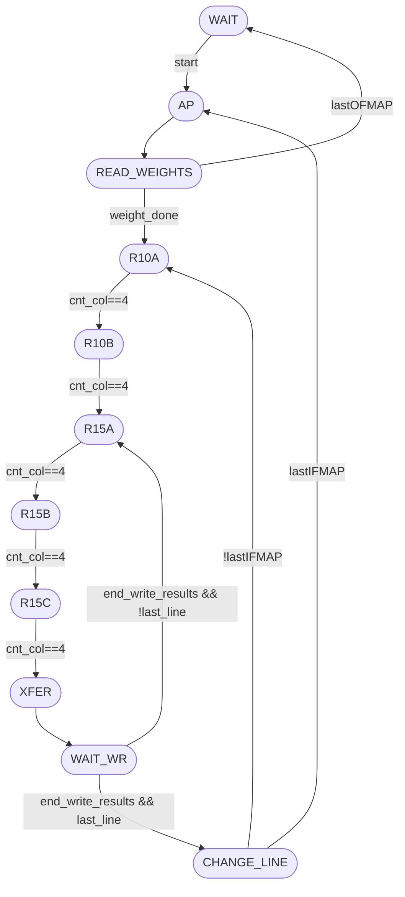
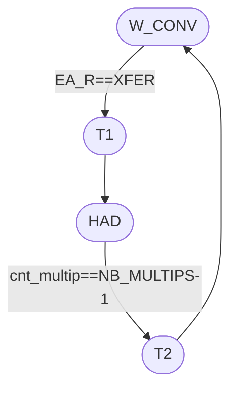
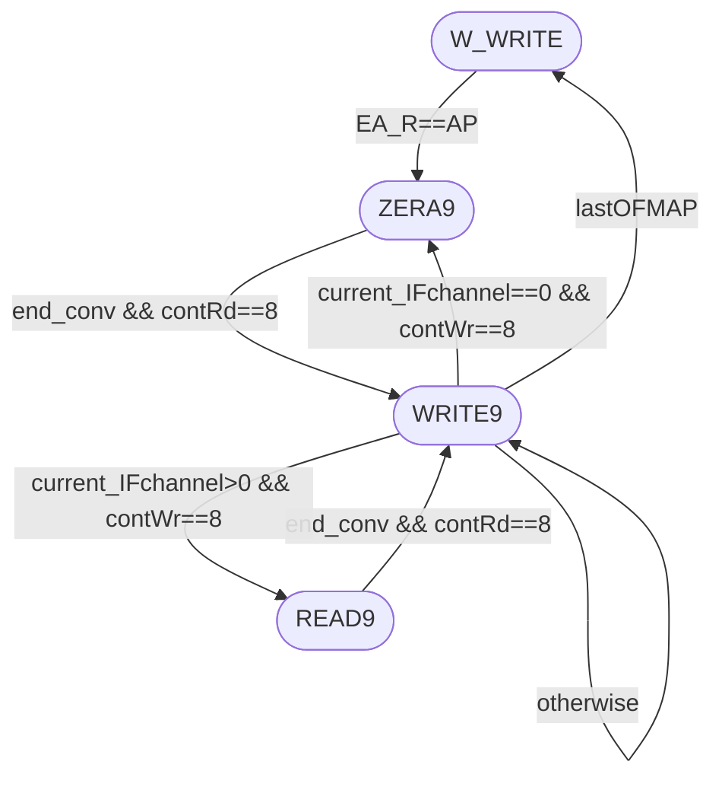

# Control Module

This folder contains the SystemVerilog source files and testbenches related to the control logic of the FastConv architecture. The control module orchestrates memory addressing, register-bank shifting, and sequencing across the convolution pipeline.

## `conv_controller`

The main control module is implemented in `conv_controller.sv`.

### Parameters

| Parameter | Type | Description |
| --- | --- | --- |
| `NB_IFMAP` | `int unsigned` | Number of input feature-map channels. |
| `NB_OFMAP` | `int unsigned` | Number of output feature-map channels. |
| `SZ_KERNEL` | `int unsigned` | Kernel size used to derive the number of streamed weights (`SZ_KERNEL*SZ_KERNEL`). |
| `NB_LINES` | `int unsigned` | Input feature-map line count. |
| `NB_COLUMNS` | `int unsigned` | Input feature-map column count. |
| `ADDR_W` | `int unsigned` | Memory address bus width. |
| `NB_MULTIPS` | `int unsigned` | Iterations used in the HAD stage of the convolution micro-sequencer. |

### Ports

| Port | Dir | Type | Description |
| --- | --- | --- | --- |
| `clk`, `rst` | in | `logic` | Clock and asynchronous reset. |
| `start` | in | `logic` | Start pulse that moves the read FSM out of `WAIT`. |
| `end_all_convolutions` | out | `logic` | End flag asserted when the write FSM returns to idle after the last OFMAP. |
| `address` | out | `logic[ADDR_W-1:0]` | Shared memory address for IFMAP and weight reads (muxed by read state). |
| `Din` | in | `logic[19:0]` | Memory read data captured into weight/input register banks. |

### Additional Notes

- The controller is partitioned into three FSMs: read/addressing (`EA_R`), convolution micro-sequencing (`EA_C`), and writeback (`EA_W`).
- Input-window storage is implemented with `Vrd[0:24]` plus `convReg[0:24]`, with row-shift behavior controlled by `ce` in state `XFER`.
- Weight streaming is controlled by `READ_WEIGHTS`, `cnt_weight`, and `ce_w`, writing `weightReg[0:WEIGHT_CYCLES-1]`.
- Writeback progression is guarded by `end_conv`, `contRd`, and `contWr` so every 3x3 output tile is sequenced before the next channel/window.

Use this module as a reference guide to understand control flow for address generation, convolution triggering, and output writeback in the FastConv controller.

## FSM Overview

The Mermaid sources live in `docs/*.mmd` and are mirrored below.

### Read / Address FSM (`EA_R`)

**Purpose**: load weights, sweep IFMAP windows, and transfer 5x5 windows into `convReg`.

- `WAIT`: idle until `start` is asserted.
- `AP`: per-channel setup and counter resets.
- `READ_WEIGHTS`: stream `SZ_KERNEL*SZ_KERNEL` weights from memory.
- `R10A` / `R10B` / `R15A` / `R15B` / `R15C`: read and shift 5 columns across 5 rows.
- `XFER`: move `Vrd[]` into `convReg[]` and advance convolution counters.
- `WAIT_WR`: wait for write FSM completion (`end_write_results`).
- `CHANGE_LINE`: move to next horizontal base or switch IFMAP/channel.

### Convolution Micro-FSM (`EA_C`)

**Purpose**: issue the internal convolution phase once `EA_R` reaches `XFER`.

- `W_CONV`: wait for a fresh window transfer.
- `T1`: initialize the multiplication counter.
- `HAD`: iterate until `cnt_multip == NB_MULTIPS-1`.
- `T2`: pulse completion (`end_conv` is set using `PE_C==T2`).

### Write FSM (`EA_W`)

**Purpose**: sequence zero/read/write phases for 3x3 result tiles.

- `W_WRITE`: idle/write-wait state before activation.
- `ZERA9`: initialization phase when `current_IFchannel==0`.
- `READ9`: read-back phase when accumulating channels (`current_IFchannel>0`).
- `WRITE9`: write 9 outputs and branch by channel/OFMAP completion.

