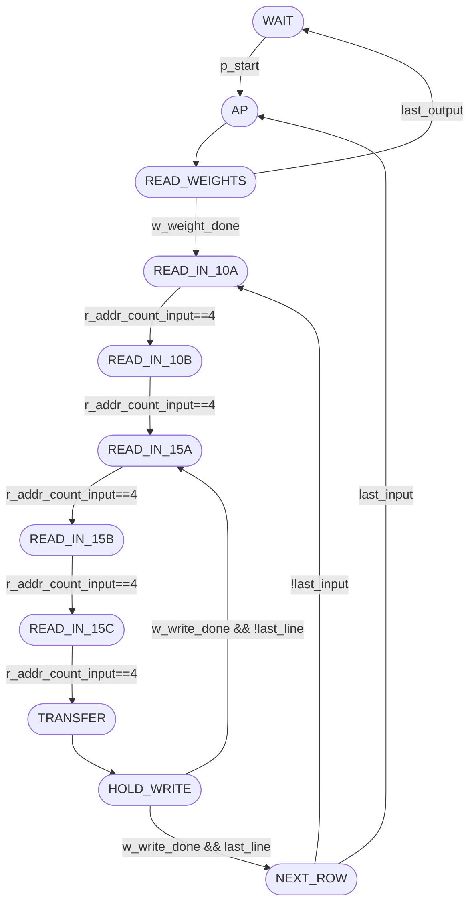
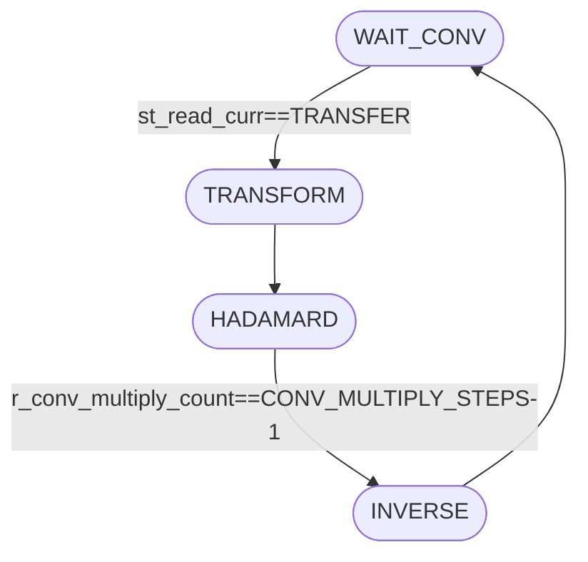
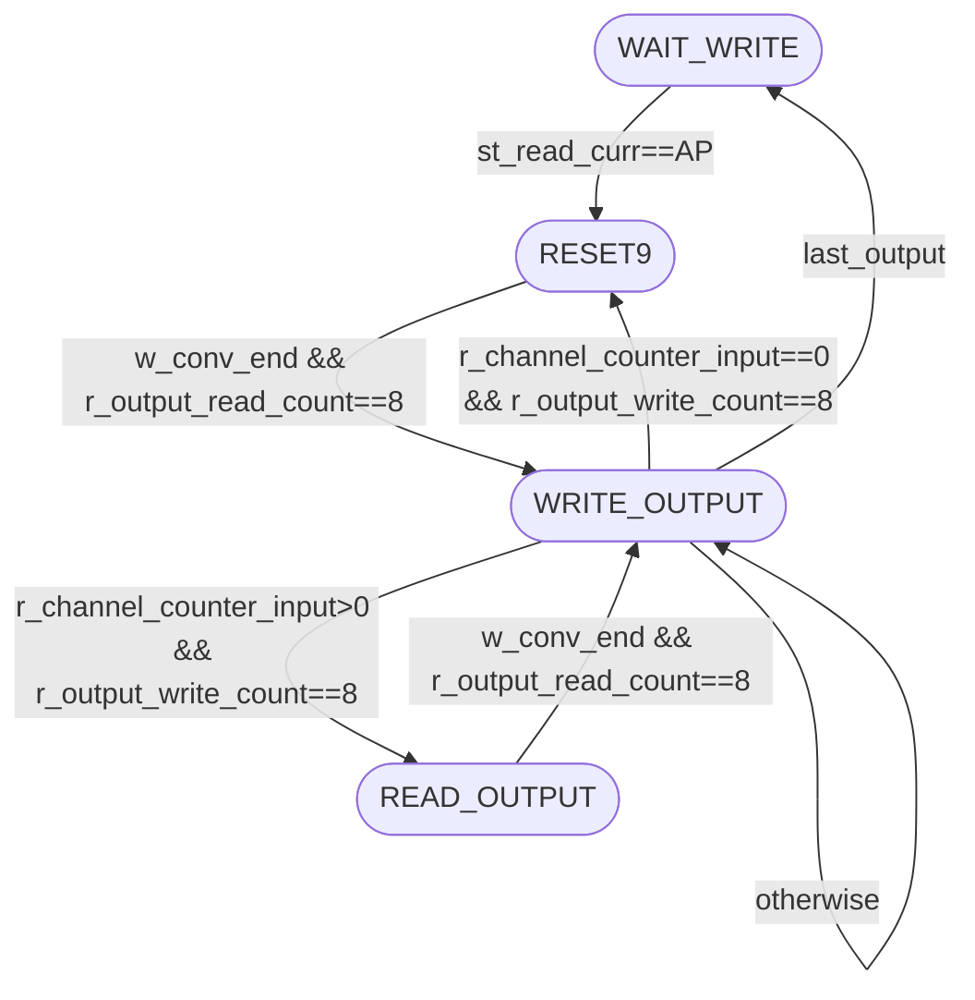

# Control Module

This folder contains the SystemVerilog source files and testbenches related to the control logic of the FastConv architecture. The control module orchestrates memory addressing, register-bank shifting, and sequencing across the convolution pipeline.

## `Control`

The main control module is implemented in `control.sv`.

### Parameters

| Parameter             | Type           | Description                                                                            |
| --------------------- | -------------- | -------------------------------------------------------------------------------------- |
| `N_CHANNEL_IN`        | `int unsigned` | Number of input feature-map channels.                                                  |
| `N_CHANNEL_OUT`       | `int unsigned` | Number of output feature-map channels.                                                 |
| `KERNEL_SIZE`         | `int unsigned` | Kernel size used to derive the number of streamed weights (`KERNEL_SIZE*KERNEL_SIZE`). |
| `FEAT_INPUT_SIZE`     | `int unsigned` | Input feature-map row count.                                                           |
| `FEAT_INPUT_WIDTH`    | `int unsigned` | Input feature-map column count.                                                        |
| `NADDR`               | `int unsigned` | Memory address bus width.                                                              |
| `CONV_MULTIPLY_STEPS` | `int unsigned` | Iterations used in the HADAMARD stage of the convolution micro-sequencer.              |

### Ports

| Port           | Dir | Type               | Description                                                                |
| -------------- | --- | ------------------ | -------------------------------------------------------------------------- |
| `clk`, `reset` | in  | `logic`            | Clock and asynchronous reset.                                              |
| `p_start`      | in  | `logic`            | Start pulse that moves the read FSM out of `WAIT`.                         |
| `p_end`        | out | `logic`            | End flag asserted when the write FSM returns to idle after the last OFMAP. |
| `p_input_addr` | out | `logic[NADDR-1:0]` | Shared memory address for IFMAP and weight reads (muxed by read state).    |
| `p_input_data` | in  | `logic[19:0]`      | Memory read data captured into weight/input register banks.                |

### Additional Notes

- The controller is partitioned into three FSMs: read/addressing (`st_read_curr`), convolution micro-sequencing (`st_conv_curr`), and writeback (`st_write_curr`).
- Input-window storage is implemented with `r_feat_input[0:24]` plus `r_conv_input[0:24]`, with row-shift behavior controlled by `w_feat_input_write_en` in state `TRANSFER`.
- Weight streaming is controlled by `READ_WEIGHTS`, `r_addr_count_kernel`, and `w_weight_write_en`, writing `weight_reg[0:WEIGHT_CYCLES-1]`.
- Writeback progression is guarded by `w_conv_end`, `r_output_read_count`, and `r_output_write_count` so every 3x3 output tile is sequenced before the next channel/window.

Use this module as a reference guide to understand control flow for address generation, convolution triggering, and output writeback in the FastConv controller.

## FSM Overview

The Mermaid sources live in `docs/*.mmd` and are mirrored below.

### Read / Address FSM (`st_read_curr`)

**Purpose**: load weights, sweep IFMAP windows, and transfer 5x5 windows into `r_conv_input`.

- `WAIT`: idle until `p_start` is asserted.
- `AP`: per-channel setup and counter resets.
- `READ_WEIGHTS`: stream `KERNEL_SIZE*KERNEL_SIZE` weights from memory.
- `READ_IN_10A` / `READ_IN_10B` / `READ_IN_15A` / `READ_IN_15B` / `READ_IN_15C`: read and shift 5 columns across 5 rows.
- `TRANSFER`: move `r_feat_input[]` into `r_conv_input[]` and advance convolution counters.
- `HOLD_WRITE`: wait for write FSM completion (`w_write_done`).
- `NEXT_ROW`: move to next horizontal base or switch IFMAP/channel.

### Convolution Micro-FSM (`st_conv_curr`)

**Purpose**: issue the internal convolution phase once `st_read_curr` reaches `TRANSFER`.

- `WAIT_CONV`: wait for a fresh window transfer.
- `TRANSFORM`: initialize the multiplication counter.
- `HADAMARD`: iterate until `r_conv_multiply_count == CONV_MULTIPLY_STEPS-1`.
- `INVERSE`: pulse completion (`w_conv_end` is set using `st_conv_next==INVERSE`).

### Write FSM (`st_write_curr`)

**Purpose**: sequence zero/read/write phases for 3x3 result tiles.

- `WAIT_WRITE`: idle/write-wait state before activation.
- `RESET9`: initialization phase when `r_channel_counter_input==0`.
- `READ_OUTPUT`: read-back phase when accumulating channels (`r_channel_counter_input>0`).
- `WRITE_OUTPUT`: write 9 outputs and branch by channel/OFMAP completion.

