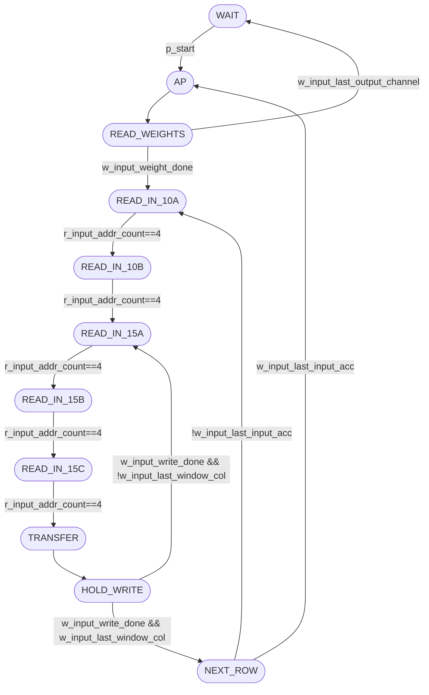
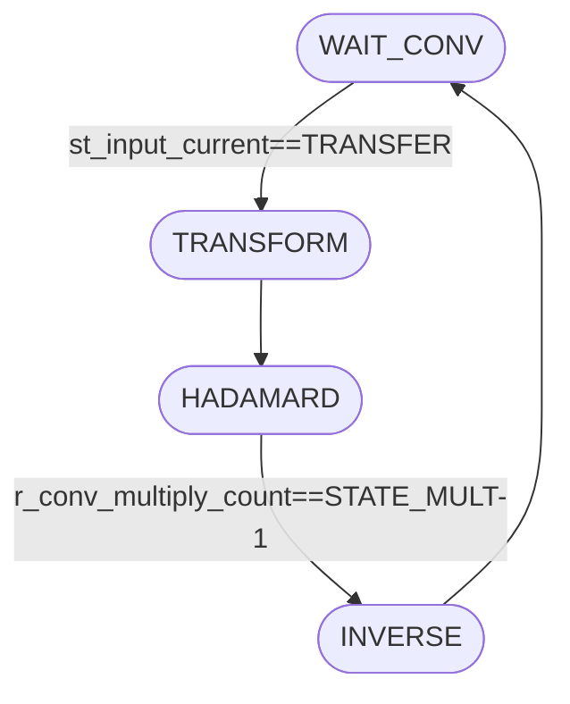
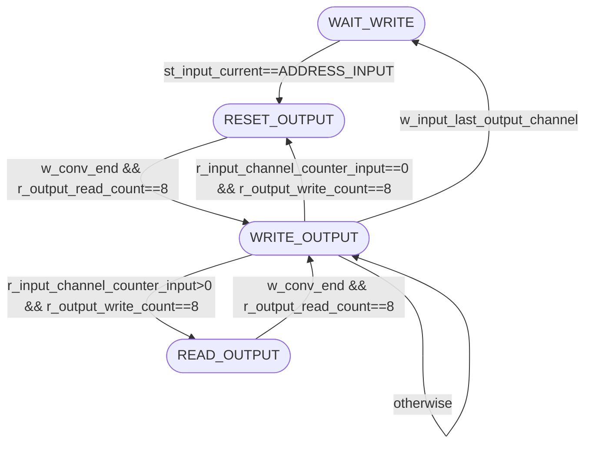

# Control Module

This folder contains the SystemVerilog source files and testbenches related to the control logic of the FastConv architecture. The control module orchestrates memory addressing, register-bank shifting, and sequencing across the convolution pipeline.

## `Control`

The main control module is implemented in `control.sv`.

### Parameters

| Parameter             | Type           | Description                                                                            |
| --------------------- | -------------- | -------------------------------------------------------------------------------------- |
| `N_CHANNEL_IN`        | `int unsigned` | Number of input feature-map channels.                                                  |
| `N_CHANNEL_OUT`       | `int unsigned` | Number of output feature-map channels.                                                 |
| `FEAT_INPUT_SIZE`     | `int unsigned` | Input feature-map row count.                                                           |
| `FEAT_INPUT_WIDTH`    | `int unsigned` | Input feature-map column count.                                                        |
| `NADDR`               | `int unsigned` | Memory address bus width.                                                              |
| `NBITS`               | `int unsigned` | Data width used by input/weight/intermediate/output data paths.                        |
| `QUANT`               | `int unsigned` | Quantization shift used by `Multip`.                                                   |
| `CONV_OUTPUT_SIZE`      | `int unsigned` | Output tile side size (Winograd output domain).                                        |
| `CONV_INPUT_SIZE`        | `int unsigned` | Input window side size (inverse/feature window domain).                                |
| `HADAMARD_SIZE`       | `int unsigned` | Hadamard/intermediate matrix side size.                                                |
| `NUM_MULT`            | `int unsigned` | Number of multipliers active per hadamard step.                                        |
| `STATE_MULT`          | `int unsigned` | Number of hadamard index states.                                                       |

### Ports

| Port           | Dir | Type               | Description                                                                |
| -------------- | --- | ------------------ | -------------------------------------------------------------------------- |
| `clk`, `reset` | in  | `logic`            | Clock and asynchronous reset.                                              |
| `p_start`      | in  | `logic`            | Start pulse that moves the read FSM out of `WAIT`.                         |
| `p_end`        | out | `logic`            | End flag asserted when the write FSM returns to idle after the last OFMAP. |
| `p_input_en`   | out | `logic`            | Input memory enable.                                                        |
| `p_input_addr` | out | `logic[NADDR-1:0]` | Shared memory address for IFMAP and weight reads (muxed by read state).    |
| `p_input_data` | in  | `logic[NBITS-1:0]` | Memory read data captured into weight/input register banks.                |
| `p_input_valid`| in  | `logic`            | Input memory read-valid flag.                                               |
| `p_output_en`  | out | `logic`            | Output memory enable.                                                       |
| `p_output_wr`  | out | `logic`            | Output memory write strobe.                                                 |
| `p_output_addr`| out | `logic[NADDR-1:0]` | Output memory address.                                                      |
| `p_output_data_write` | out | `logic[NBITS-1:0]` | Output memory write data.                                            |
| `p_output_data_read`  | in  | `logic[NBITS-1:0]` | Output memory read data.                                             |
| `p_output_valid`      | in  | `logic`            | Output memory read-valid flag.                                       |

### Additional Notes

- The controller is partitioned into three FSMs: input/addressing (`st_input_current`), convolution micro-sequencing (`st_conv_current`), and writeback (`st_output_current`).
- Input-window storage is implemented with `r_input_feat[0:24]` plus `r_conv_input[0:24]`, with row-shift behavior controlled by `w_input_feat_en` in state `TRANSFER`.
- Weight streaming is controlled by `READ_WEIGHTS`, `r_input_count_kernel`, and `w_weight_write_en`, writing `r_input_weight[0:WEIGHT_CYCLES-1]`.
- Writeback progression is guarded by `w_conv_end`, `r_output_read_count`, and `r_output_write_count` so every 3x3 output tile is sequenced before the next channel/window.
- Output base addressing is tracked by `r_addr_pointer_output`, advancing by output-window column stride and wrapping to the next row at line end.
- Output tile offseting (inside each 3x3 write/read burst) is generated in `OUTPUT_ADDR_OFFSET_BLOCK` with `always_ff` registers (`r_output_addr_offset_read`/`r_output_addr_offset_write`) using incremental stride/wrap steps, without lookup `case`, function calls, division, or modulo.

### Recent RTL Updates

- Input testbench memory now uses `Memory` with `ROM=1`, reading dataset samples from `pack_data::const_data`.
- `p_output_wr` stays asserted for every `WRITE_OUTPUT` beat, including the last output window.
- `p_output_en` keeps read active through the last output element of each 3x3 writeback burst.
- Width calculations were standardized with helper function `f_width_min1(x)` in `conv.sv` for safer `$clog2` usage when `x<=1`.
- Output address internals (`r_output_addr_offset_*`, `r_output_addr_channel`, `r_output_addr_col`, `r_output_addr_row`) were narrowed with dedicated width localparams.
- Output read/write counters are parameterized by `CONV_OUTPUT_SIZE` (`OUTPUT_RW_COUNT_MAX`, `OUTPUT_RW_COUNT_WIDTH`) instead of fixed constants.

Use this module as a reference guide to understand control flow for address generation, convolution triggering, and output writeback in the FastConv controller.

## Waveform Script

- `wave.do` is maintained for both GUI and batch flows.
- Unsupported GUI-only commands in batch mode (`vsim -c`), such as `configure wave`/`WaveRestore*`, were removed to avoid transcript errors.

## FSM Overview

The Mermaid sources live in `docs/*.mmd` and are mirrored below.

### Read / Address FSM (`st_input_current`)

**Purpose**: load weights, sweep IFMAP windows, and transfer 5x5 windows into `r_conv_input`.

- `WAIT`: idle until `p_start` is asserted.
- `AP`: per-channel setup and counter resets.
- `READ_WEIGHTS`: stream `HADAMARD_SIZE*HADAMARD_SIZE` weights from memory.
- `READ_IN_10A` / `READ_IN_10B` / `READ_IN_15A` / `READ_IN_15B` / `READ_IN_15C`: read and shift 5 columns across 5 rows.
- `TRANSFER`: move `r_input_feat[]` into `r_conv_input[]` and advance convolution counters.
- `HOLD_WRITE`: wait for write FSM completion (`w_input_write_done`).
- `NEXT_ROW`: move to next horizontal base or switch IFMAP/channel.

#### Column-Read Process Notes

- The read path uses two 5x5 banks:
  - `r_input_feat`: window read/shift bank.
  - `r_conv_input`: bank transferred to the convolution datapath.
- The sequence is split as:
  - `READ_IN_10A` -> `READ_IN_10B` -> `READ_IN_15A` -> `READ_IN_15B` -> `READ_IN_15C`.
- Each read state performs 5 accesses and transitions when `r_input_addr_count == 4`.
- `TRANSFER` copies the 25 elements to `r_conv_input` and decides whether to continue vertical sweep (`READ_IN_15A`) or go to `NEXT_ROW`.
- `NEXT_ROW` advances the base address logic to the next window position (or next IFMAP/channel, depending on end flags).

Key registers in this process:

- `st_input_current`, `st_input_next`: input FSM state/current-next.
- `r_input_addr_count`: inner 0..4 read counter used in all `READ_IN_*` states.
- `r_input_window_counter_acc`: increments in `TRANSFER` and resets in `ADDRESS_INPUT`; tracks total windows processed in the current IFMAP channel.
- `r_input_window_counter_col`: increments in `TRANSFER`, resets in `NEXT_ROW_INPUT`/`ADDRESS_INPUT`; tracks windows in the current row sweep.
- `r_input_count_kernel`: increments in `READ_WEIGHTS`; tracks weight-read index inside one kernel load.
- `w_input_base_feat`: write-base selector used to place incoming samples in `r_input_feat`.
- Address generation uses base + row/column offsets with `FEAT_INPUT_WIDTH` as line stride.

### Convolution Micro-FSM (`st_conv_current`)

**Purpose**: issue the internal convolution phase once `st_input_current` reaches `TRANSFER`.

- `WAIT_CONV`: wait for a fresh window transfer.
- `TRANSFORM`: initialize the multiplication counter.
- `HADAMARD`: iterate until `r_conv_multiply_count == STATE_MULT-1`.
- `INVERSE`: pulse completion and return to `WAIT_CONV`.

### Write FSM (`st_output_current`)

**Purpose**: sequence zero/read/write phases for 3x3 result tiles.

- `WAIT_WRITE`: idle/write-wait state before activation.
- `RESET9`: initialization phase when `r_input_channel_counter_input==0`.
- `READ_OUTPUT`: read-back phase when accumulating channels (`r_input_channel_counter_input>0`).
- `WRITE_OUTPUT`: write 9 outputs and branch by channel/OFMAP completion.

